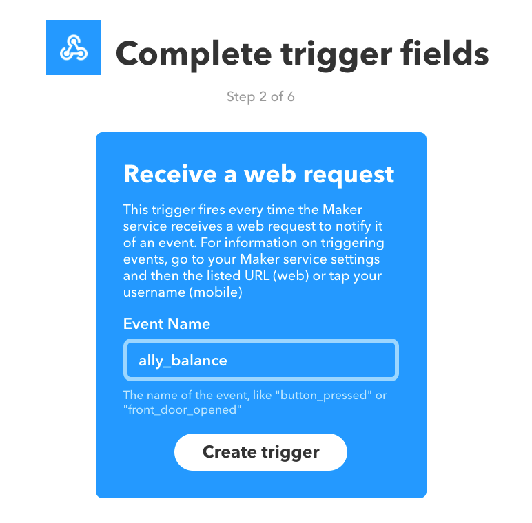

# ally_balance
Get an alert with your Ally Bank account balances. This is something that Wells Fargo provides, but is not provided by Ally Bank at this time. This script will log into Ally Bank on your behalf and fetch your account balances, then send them to you via the channel of your choosing.

## Preparing the alert
This package uses [IFTTT](iftt.com) to send alerts. This script acts as a webhook
trigger, so you must set up a new webhook before using this script.

First, log into (or register for an account at) [ifttt.com](https://ifttt.com/) and navigate to applets. Click "New Applet".

Select "Webhooks" as the service.

Give your webhook an event name. Hang onto this, because you'll need it later.

From there, you'll have the option to send your account balances to any number of services. I chose to receive my account balances via email.

## Installation
To install this package, run:

    npm install ally_balance

This will install a new command line script: `ally_balance`

The script relies on four environment variables for proper operation:

    ALLY_BANK_USERNAME  The username for your Ally Bank account
    ALLY_BANK_PASSWORD  The password for your Ally Bank account
    IFTTT_ALLY_EVENT_NAME   The event name for the webhook you set up above
    IFTTT_API_KEY   Your IFTTT API key

Once you have created these environment variables in the scope of where the script will be run (either via something like a .bash_profile or prepended to the command line invocation below), invoke the script without any parameters:

    ally_balance

This will log into your bank account using [chromeless](https://github.com/graphcool/chromeless), scrape your account balances, then trigger your IFTTT webhook using this information as `value1`. Now you can set up a cron job to deliver your account balances as often as you'd like. That's all there is to it!